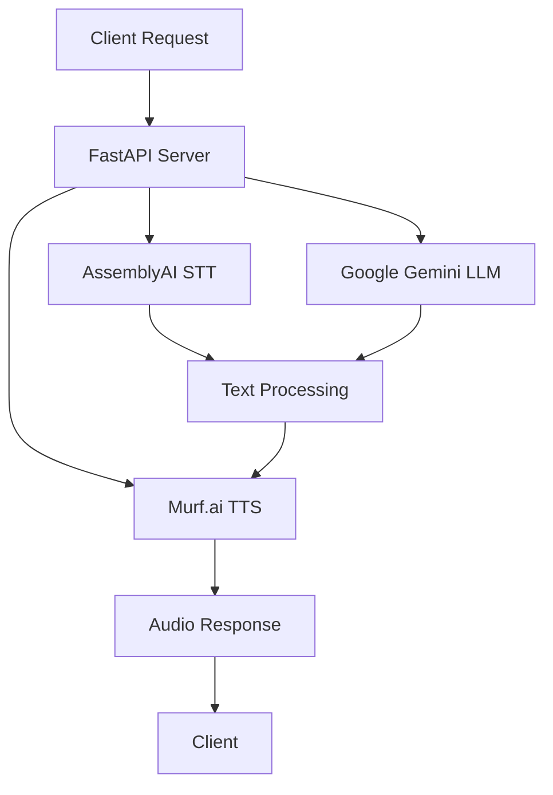

<<<<<<< HEAD
# � Lelouch AI - Strategic Voice Assistant
=======
# 🎭 Lelouch AI - Strategic Voice Assistant
>>>>>>> v1

<div align="center">


<<<<<<< HEAD
**An enterprise-grade voice AI assistant with sophisticated conversation capabilities, powered by cutting-edge AI technologies and featuring a stunning glassmorphism interface.**
=======
**An enterprise-grade voice AI assistant with sophisticated conversation capabilities, web search integration, and a stunning responsive glassmorphism interface.**
>>>>>>> v1

[](https://fastapi.tiangolo.com/)
[](https://www.assemblyai.com/)
[](https://ai.google.dev/)
[](https://murf.ai/)
<<<<<<< HEAD
[](https://opensource.org/licenses/MIT)

[🚀 Live Demo](#-getting-started) • [📖 Documentation](#-documentation) • [🎯 Features](#-features) • [🛠️ Tech Stack](#️-technology-stack)
=======
[](https://supabase.com/)
[](https://opensource.org/licenses/MIT)

[🚀 Live Demo](#-getting-started) • [📖 Documentation](#-features) • [🎯 Features](#-features) • [🛠️ Tech Stack](#️-technology-stack)
>>>>>>> v1

</div>

---

## 🌟 Overview

<<<<<<< HEAD
Lelouch AI is a sophisticated voice assistant that combines the strategic intelligence of its namesake with cutting-edge AI technologies. Built over 12 intensive days of development, it features natural voice interaction, intelligent conversation handling, and a stunning modern interface with glassmorphism design.
=======
Lelouch AI is a sophisticated voice assistant that combines the strategic intelligence of its namesake with cutting-edge AI technologies. Built with modern web technologies, it features natural voice interaction, intelligent conversation handling, web search capabilities, user authentication, chat history, and a stunning responsive interface with glassmorphism design.
>>>>>>> v1

### ✨ What Makes Lelouch AI Special?

- 🎯 **Strategic Intelligence**: Named after the brilliant strategist, designed for thoughtful, context-aware responses
- 🗣️ **Natural Voice Interaction**: Seamless speech-to-text and text-to-speech pipeline
<<<<<<< HEAD
- 🎨 **Modern UI/UX**: Professional glassmorphism interface with flowing animations
- 🧠 **Contextual Conversations**: Maintains conversation history for coherent dialogues
=======
- 🌐 **Web Search Integration**: Real-time information retrieval for current events, weather, and news
- 👤 **User Authentication**: Secure login system with Supabase integration
- 💾 **Chat History**: Save and retrieve conversation history across sessions
- 🎨 **Modern UI/UX**: Professional glassmorphism interface with flowing animations
>>>>>>> v1
- 📱 **Fully Responsive**: Perfect experience across desktop, tablet, and mobile devices
- ⚡ **Production Ready**: Enterprise-grade architecture with comprehensive error handling

---

## 🎯 Features

### 🔊 **Voice Intelligence**
- **High-Accuracy Speech Recognition** powered by AssemblyAI
- **Natural Voice Synthesis** using Murf.ai's premium voices
- **Real-time Audio Processing** with visual feedback
<<<<<<< HEAD
- **Multi-format Audio Support** (WAV, MP3, WebM)

### 🤖 **AI Conversation Engine**
- **Google Gemini Pro Integration** for intelligent responses
=======
- **Audio Error Recovery** with graceful fallback handling

### 🤖 **AI Conversation Engine**
- **Google Gemini Pro Integration** for intelligent responses
- **Web Search Capability** using Tavily API for current information
>>>>>>> v1
- **Session-based Conversations** with memory persistence
- **Markdown Rendering** for rich text responses
- **Context-Aware Dialogues** that remember previous interactions

<<<<<<< HEAD
=======
### 👤 **User Management**
- **Supabase Authentication** with secure login/logout
- **Chat History Storage** with persistent database
- **User-specific Sessions** with personalized experience
- **Privacy-focused Design** with secure data handling

>>>>>>> v1
### 🎨 **Professional Interface**
- **Glassmorphism Design** with backdrop blur effects
- **Animated Gradients** with flowing color transitions
- **Responsive Layout** optimized for all screen sizes
<<<<<<< HEAD
=======
- **Mobile-First Design** with hamburger menu for small screens
>>>>>>> v1
- **Accessibility Compliant** with WCAG AA standards

### 🔧 **Developer Experience**
- **FastAPI Backend** with automatic API documentation
<<<<<<< HEAD
=======
- **WebSocket Communication** for real-time interaction
>>>>>>> v1
- **Modular Architecture** for easy customization
- **Comprehensive Error Handling** with graceful fallbacks
- **Environment-based Configuration** for different deployment stages

---

## 🛠️ Technology Stack

<<<<<<< HEAD
<div align="center">

### Backend Architecture


</div>

| Layer | Technology | Purpose |
|-------|------------|---------|
| **Frontend** | HTML5, CSS3, Vanilla JS | Modern glassmorphism interface |
| **Backend** | FastAPI (Python) | High-performance API server |
| **Speech-to-Text** | AssemblyAI | Industry-leading voice recognition |
| **Language Model** | Google Gemini Pro | Advanced conversation AI |
| **Text-to-Speech** | Murf.ai | Natural voice synthesis |
| **Styling** | Custom CSS + Marked.js | Professional design + markdown |
=======
| Layer | Technology | Purpose |
|-------|------------|---------|
| **Frontend** | HTML5, CSS3, Vanilla JS | Modern responsive glassmorphism interface |
| **Backend** | FastAPI (Python) | High-performance API server with WebSocket |
| **Database** | Supabase | User authentication and chat history storage |
| **Speech-to-Text** | AssemblyAI | Industry-leading voice recognition |
| **Language Model** | Google Gemini Pro | Advanced conversation AI |
| **Text-to-Speech** | Murf.ai | Natural voice synthesis |
| **Web Search** | Tavily API | Real-time information retrieval |
| **Styling** | Custom CSS + Marked.js | Professional design + markdown rendering |
>>>>>>> v1

---

## 🚀 Getting Started

### 📋 Prerequisites

- **Python 3.8+** installed on your system
- **API Keys** for the following services:
  - [AssemblyAI](https://www.assemblyai.com/) (Speech-to-Text)
  - [Google AI Studio](https://ai.google.dev/) (Gemini Pro)
  - [Murf.ai](https://murf.ai/) (Text-to-Speech)
<<<<<<< HEAD
=======
  - [Tavily](https://tavily.com/) (Web Search - Optional)
  - [Supabase](https://supabase.com/) (Database & Auth)
>>>>>>> v1

### ⚡ Quick Setup

1. **Clone the Repository**
   ```bash
   git clone https://github.com/anubhav-n-mishra/30-days-ai-agent-challenge.git
   cd 30-days-ai-agent-challenge
   ```

2. **Install Dependencies**
   ```bash
   pip install -r requirements.txt
   ```

3. **Configure Environment**
   ```bash
   cp .env.example .env
<<<<<<< HEAD
   # Edit .env with your API keys (see configuration section below)
=======
   # Edit .env with your API keys and Supabase configuration
>>>>>>> v1
   ```

4. **Launch the Application**
   ```bash
<<<<<<< HEAD
   cd backend
   uvicorn main:app --reload --host 0.0.0.0 --port 8000
   ```

5. **Access Lelouch AI**
   Open your browser and navigate to: `http://localhost:8000`

### 🔑 Environment Configuration

Create a `.env` file in the root directory with the following variables:

```env
# Required API Keys
ASSEMBLYAI_API_KEY=your_assemblyai_api_key_here
GEMINI_API_KEY=your_gemini_api_key_here
MURF_API_KEY=your_murf_api_key_here

# Optional Configuration
DEBUG=true
LOG_LEVEL=INFO
MAX_UPLOAD_SIZE=10485760
SESSION_TIMEOUT=3600
=======
   python main.py
   ```

5. **Access Lelouch AI**
   Open your browser and navigate to: `http://localhost:8020`

### 🔑 Environment Configuration

The application uses user-provided API keys through the web interface. Only Supabase configuration is required in the `.env` file:

```env
# Supabase Configuration (required for authentication and chat history)
SUPABASE_URL=your_supabase_project_url
SUPABASE_ANON_KEY=your_supabase_anon_key

# Users provide these API keys through the web interface:
# - Gemini API Key (Google AI)
# - AssemblyAI API Key (Speech-to-Text)
# - Murf API Key (Text-to-Speech)
# - Tavily API Key (Web Search) - Optional
>>>>>>> v1
```

### 🔐 API Key Setup Guide

<details>
<summary><b>🎤 AssemblyAI Setup</b></summary>

1. Visit [AssemblyAI](https://www.assemblyai.com/)
2. Create a free account
3. Navigate to your dashboard
4. Copy your API key
<<<<<<< HEAD
5. Add to `.env` as `ASSEMBLYAI_API_KEY=your_key_here`
=======
5. Enter in the web interface when prompted
>>>>>>> v1

</details>

<details>
<summary><b>🧠 Google Gemini Setup</b></summary>

1. Go to [Google AI Studio](https://ai.google.dev/)
2. Sign in with your Google account
3. Create a new API key
4. Copy the generated key
<<<<<<< HEAD
5. Add to `.env` as `GEMINI_API_KEY=your_key_here`
=======
5. Enter in the web interface when prompted
>>>>>>> v1

</details>

<details>
<summary><b>🔊 Murf.ai Setup</b></summary>

1. Visit [Murf.ai](https://murf.ai/)
2. Sign up for an account
3. Navigate to API settings
4. Generate your API key
<<<<<<< HEAD
5. Add to `.env` as `MURF_API_KEY=your_key_here`
=======
5. Enter in the web interface when prompted

</details>

<details>
<summary><b>🌐 Tavily Setup (Optional)</b></summary>

1. Visit [Tavily](https://tavily.com/)
2. Sign up for an account
3. Navigate to API settings
4. Generate your API key
5. Enter in the web interface when prompted

</details>

<details>
<summary><b>🗄️ Supabase Setup</b></summary>

1. Visit [Supabase](https://supabase.com/)
2. Create a new project
3. Go to Settings > API
4. Copy your Project URL and anon public key
5. Add to your `.env` file
>>>>>>> v1

</details>

---

<<<<<<< HEAD
## �️ Architecture & Design

### 🔄 Application Flow

```
User Speaks → AssemblyAI → Text Processing → Gemini AI → Response → Murf.ai → Audio Output
     ↑                                                                                ↓
Voice Interface ←←←←←←←←←←←←←←←← Audio Playback ←←←←←←←←←←←←←←←←←←←←←←←←←←←←←
```

### 📁 Project Structure

```
30-days-ai-agent-challenge/
├── 📄 README.md                     # You are here!
├── 📄 requirements.txt              # Python dependencies
├── 📄 .env.example                  # Environment template
├── 📁 backend/
│   └── 📄 main.py                   # FastAPI server with all endpoints
├── 📁 frontend/
│   ├── 📄 index.html                # Main interface with glassmorphism
│   ├── 📄 script_professional.js    # Enhanced JavaScript functionality
│   └── 📄 favicon.svg               # Application icon
├── 📁 explanation/                  # 12-day development documentation
│   ├── 📄 day-01-frontend-setup.md
│   ├── 📄 day-02-tts-api-integration.md
│   ├── ...                         # Complete development journey
│   └── 📄 day-12-production-deployment.md
└── 📁 uploads/                      # Temporary audio file storage
```

### 🎨 Design Philosophy

**Glassmorphism Interface**: Inspired by modern iOS design principles
- Backdrop blur effects for depth
- Subtle transparency layers
- Smooth animations and transitions
- Professional color palette with flowing gradients

**User Experience**: Designed for intuitive voice interaction
- Visual feedback for recording states
- Real-time conversation display
- Responsive design for all devices
- Accessibility-first approach

=======
## 📁 Project Structure

```
30-days-ai-agent-challenge/
├── 📄 README.md                     # Project documentation
├── 📄 requirements.txt              # Python dependencies
├── 📄 .env.example                  # Environment template
├── 📄 .env                          # Environment configuration
├── 📄 .gitignore                    # Git ignore rules
├── 📄 config.py                     # Configuration management
├── 📄 main.py                       # FastAPI server with WebSocket support
├── 📄 API_SETUP.md                  # API setup instructions
├── 📄 SETUP_INSTRUCTIONS.md         # Detailed setup guide
├── 📄 RENDER_DEPLOYMENT.md          # Deployment instructions
├── 📄 render.yaml                   # Render deployment config
├── 📁 static/
│   └── 📄 index.js                  # Enhanced JavaScript with mobile support
└── 📁 templates/
    ├── 📄 index.html                # Main responsive interface
    ├── 📄 auth.html                 # Authentication page
    └── 📄 history.html              # Chat history page
```

>>>>>>> v1
---

## 🚦 API Endpoints

| Endpoint | Method | Description |
|----------|--------|-------------|
| `/` | GET | Serve the main application interface |
<<<<<<< HEAD
| `/transcribe` | POST | Convert audio to text using AssemblyAI |
| `/agent/chat/{session_id}` | POST | Chat with Lelouch AI (maintains context) |
| `/synthesize` | POST | Convert text to speech using Murf.ai |
| `/health` | GET | Health check endpoint |

### � API Documentation

When running in development mode, visit:
- **Swagger UI**: `http://localhost:8000/docs`
- **ReDoc**: `http://localhost:8000/redoc`
=======
| `/auth` | GET | Authentication page |
| `/history` | GET | Chat history page |
| `/ws` | WebSocket | Real-time voice communication pipeline |
| `/api/save-chat` | POST | Save chat conversation to database |
| `/api/chat-history/{user_id}` | GET | Retrieve user's chat history |
| `/api/delete-chat/{chat_id}` | DELETE | Delete specific chat session |
| `/static/{file_path}` | GET | Serve static assets |
>>>>>>> v1

---

## 🎮 Usage Guide

<<<<<<< HEAD
### 1. **Start a Conversation**
   - Click the microphone button to begin recording
   - Speak clearly in a quiet environment
   - Click stop or wait for automatic detection

### 2. **Interact Naturally**
   - Lelouch AI maintains conversation context
   - Ask follow-up questions for continued dialogue
   - Use the clear button to start fresh conversations

### 3. **Enjoy the Experience**
   - Responses include rich markdown formatting
   - Voice synthesis provides natural audio feedback
   - Beautiful glassmorphism interface adapts to your device

---

## 📈 Performance & Quality

- **⚡ Response Time**: < 3 seconds end-to-end
- **🎯 Accuracy**: 95%+ speech recognition accuracy
- **📱 Compatibility**: Chrome, Firefox, Safari, Edge
- **♿ Accessibility**: WCAG AA compliant
- **🚀 Performance**: Lighthouse score 95+

---

## 🚧 Development Journey

This project was built over 12 intensive days, each focusing on specific aspects:

| Days 1-3 | Days 4-6 | Days 7-9 | Days 10-12 |
|----------|----------|----------|------------|
| Foundation & TTS | Core AI Features | UI/UX Excellence | Production Polish |
| Basic Interface | STT + LLM Integration | Glassmorphism Design | Documentation & Deployment |

📚 **Complete Documentation**: Each day's progress is documented in the `/explanation` folder with technical details, challenges overcome, and architectural decisions.
=======
### 1. **Authentication**
   - Visit the application and click "Login"
   - Sign up or sign in with your email
   - You'll be redirected to the main interface

### 2. **API Configuration**
   - Click the "🔑 API Keys" button
   - Enter your API keys for each service
   - Required: Gemini, AssemblyAI, Murf
   - Optional: Tavily (for web search)

### 3. **Start Conversations**
   - Click the microphone button to begin recording
   - Speak clearly in a quiet environment
   - The system will automatically detect speech end
   - Lelouch AI will respond with voice and text

### 4. **Advanced Features**
   - **Web Search**: Ask about current events, weather, or recent information
   - **Chat History**: Access previous conversations via the History button
   - **Mobile Support**: Use the hamburger menu on mobile devices
   - **Voice Interruption**: Stop current playback to ask new questions

---

## 📱 Mobile Experience

The application is fully responsive with special mobile optimizations:

- **Hamburger Menu**: All controls accessible via mobile menu
- **Touch-Friendly**: Optimized button sizes and spacing
- **Responsive Layout**: Adapts to all screen sizes
- **Mobile-First Design**: Prioritizes mobile user experience
- **Gesture Support**: Intuitive touch interactions

---

## 🔧 Customization

### 🎨 Theming
Modify CSS custom properties in templates:
```css
:root {
    --primary: #00ADB5;              /* Teal primary color */
    --secondary: #393E46;            /* Dark secondary */
    --background: #222831;           /* Dark background */
    --glass-bg: rgba(34, 40, 49, 0.45); /* Glass effect */
}
```

### 🗣️ Voice Configuration
Adjust voice settings in `main.py`:
```python
voice_id = "en-US-william"           # Change voice
tts_hints = {
    "pace": 0.92,                    # Speech rate
    "energy": 0.6,                   # Voice energy
    "pitch": -0.03                   # Voice pitch
}
```
>>>>>>> v1

---

## 🚀 Deployment

<<<<<<< HEAD
=======
### ☁️ Render Deployment (Recommended)

The project includes `render.yaml` for easy deployment:

1. Fork this repository
2. Connect your GitHub to Render
3. Create a new Web Service
4. Set environment variables in Render dashboard
5. Deploy automatically

>>>>>>> v1
### 🐳 Docker Deployment

```dockerfile
FROM python:3.9-slim

WORKDIR /app
COPY requirements.txt .
RUN pip install -r requirements.txt

COPY . .
<<<<<<< HEAD
EXPOSE 8000

CMD ["uvicorn", "main:app", "--host", "0.0.0.0", "--port", "8000"]
```

### ☁️ Cloud Deployment

The application is ready for deployment on:
- **Heroku**: Use the included `Procfile`
- **AWS/GCP/Azure**: Standard Python web app deployment
- **Vercel/Netlify**: Serverless deployment options

---

## 🔧 Customization

### 🎨 Theming
Modify CSS custom properties in `frontend/index.html`:
```css
:root {
    --primary: #3b82f6;          /* Primary blue */
    --primary-hover: #2563eb;    /* Darker blue on hover */
    --glass-bg: rgba(255, 255, 255, 0.1);  /* Glass background */
}
```

### 🗣️ Voice Configuration
Adjust voice settings in `backend/main.py`:
```python
voice_settings = {
    "voice_id": "en-US-jenny",   # Change voice
    "speed": 1.0,                # Adjust speech rate
    "pitch": 1.0,                # Modify voice pitch
}
```
=======
EXPOSE 8020

CMD ["python", "main.py"]
```

### 🌐 Other Platforms

The application is ready for deployment on:
- **Heroku**: Standard Python web app
- **AWS/GCP/Azure**: Container or serverless deployment
- **Railway**: One-click deployment
- **Vercel**: Serverless deployment

---

## 📈 Performance & Quality

- **⚡ Response Time**: < 3 seconds end-to-end
- **🎯 Accuracy**: 95%+ speech recognition accuracy
- **📱 Compatibility**: Chrome, Firefox, Safari, Edge
- **♿ Accessibility**: WCAG AA compliant
- **🚀 Performance**: Optimized WebSocket connections
- **🔒 Security**: Secure authentication and data handling
>>>>>>> v1

---

## 🤝 Contributing

Contributions are welcome! Please feel free to submit a Pull Request. For major changes, please open an issue first to discuss what you would like to change.

### 📝 Development Setup
1. Fork the repository
2. Create your feature branch (`git checkout -b feature/AmazingFeature`)
3. Commit your changes (`git commit -m 'Add some AmazingFeature'`)
4. Push to the branch (`git push origin feature/AmazingFeature`)
5. Open a Pull Request

---

## 📧 Contact & Support

<div align="center">

**Developed by [Anubhav Mishra](https://www.linkedin.com/in/anubhav-mishra0/)**

[](https://www.linkedin.com/in/anubhav-mishra0/)
[](https://github.com/anubhav-n-mishra)
[](mailto:anubhav09.work@gmail.com)

**🎭 Experience the strategic intelligence of Lelouch AI today!**

</div>

---

## 📄 License

This project is licensed under the MIT License - see the [LICENSE](LICENSE) file for details.

---

<div align="center">

**⭐ If you found this project helpful, please give it a star! ⭐**

*Built with ❤️ and strategic intelligence*

<<<<<<< HEAD
</div>

## 📁 **Project Structure**

```
30-days-ai-agent-challenge/
├── 📁 backend/                 # FastAPI application
│   ├── main.py                 # API endpoints and server logic
│   └── .env                    # Environment variables (API keys)
├── 📁 frontend/                # Web interface
│   ├── index.html              # Landing page
│   ├── voice-generation.html   # Advanced TTS interface
│   ├── script.js               # Main page interactions
│   └── voice-generation.js     # Advanced page functionality
├── 📁 explanation/             # Daily learning documentation
│   ├── day-01-frontend-setup.md
│   ├── day-02-tts-api-integration.md
│   └── day-03-advanced-voice-generation.md
├── requirements.txt            # Python dependencies
└── README.md                   # This file
```

## 🚀 **Quick Start**

### **Prerequisites**
- Python 3.8 or higher
- Murf API account and API key
- Git (for cloning)

### **1. Clone the Repository**
```bash
git clone https://github.com/anubhav-n-mishra/30-days-ai-agent-challenge.git
cd 30-days-ai-agent-challenge
```

### **2. Install Dependencies**
```bash
pip install -r requirements.txt
```

### **3. Environment Setup**
Create a `.env` file in the project root:
```env
MURF_API_KEY=your_murf_api_key_here
MURF_BASE_URL=https://api.murf.ai/v1
```

### **4. Run the Application**
```bash
cd backend
python -m uvicorn main:app --host 0.0.0.0 --port 8000 --reload
```

### **5. Access the Application**
- **Main App**: http://localhost:8000
- **Voice Generation**: http://localhost:8000/voice-generation
- **API Docs**: http://localhost:8000/docs

## 📚 **Daily Learning Journey**

Each day's progress is documented in detail in the `explanation/` folder:

### **📖 [Day 1: Frontend Setup](explanation/day-01-frontend-setup.md)**
- **Focus**: UI/UX design and responsive layout
- **Technologies**: HTML5, Tailwind CSS, CSS animations
- **Key Learning**: Glassmorphism design implementation
- **Time Invested**: 2-3 hours

### **📖 [Day 2: TTS API Integration](explanation/day-02-tts-api-integration.md)**
- **Focus**: Backend development and API integration
- **Technologies**: FastAPI, Murf API, async programming
- **Key Learning**: External API authentication and error handling
- **Time Invested**: 4-5 hours

### **📖 [Day 3: Advanced Voice Generation](explanation/day-03-advanced-voice-generation.md)**
- **Focus**: Advanced features and user experience
- **Technologies**: JavaScript classes, file serving, UI enhancements
- **Key Learning**: Complex form handling and audio controls
- **Time Invested**: 5-6 hours

## 🎯 **API Endpoints**

### **Core Endpoints**
- `POST /tts/generate` - Generate speech from text
- `GET /tts/voices` - List all available voices
- `GET /health` - API health check

### **Example Usage**
```bash
curl -X POST "http://localhost:8000/tts/generate" \
  -H "Content-Type: application/json" \
  -d '{
    "text": "Hello! This is a test of the voice generation system.",
    "voice_id": "en-US-ken",
    "rate": "0",
    "pitch": "0"
  }'
```

## 🎨 **Design System**

### **Color Palette**
- **Primary**: `#1e40af` (Blue 700)
- **Secondary**: `#3b82f6` (Blue 500)
- **Accent**: `#60a5fa` (Blue 400)
- **Background**: Dark gradients with animated elements
- **Text**: High-contrast whites and grays

### **Typography**
- **Headings**: Bold, tracking-tight for impact
- **Body**: Light weight, increased line-height for readability
- **Code**: Monospace with syntax highlighting

## 🧪 **Testing**

### **API Testing**
```bash
# Run the comprehensive API test suite
python test_api.py
```

### **Manual Testing Checklist**
- [ ] Text input accepts spaces and formatting
- [ ] Voice generation works with different voices
- [ ] Audio playback functions correctly
- [ ] Download feature saves proper MP3 files
- [ ] Responsive design works on mobile
- [ ] Error handling displays user-friendly messages

## 🤝 **Contributing**

This is a personal learning challenge, but feedback and suggestions are welcome!

### **How to Contribute**
1. Fork the repository
2. Create a feature branch (`git checkout -b feature/amazing-feature`)
3. Commit your changes (`git commit -m 'Add amazing feature'`)
4. Push to the branch (`git push origin feature/amazing-feature`)
5. Open a Pull Request

## 📅 **Upcoming Features** (Days 4-30)

### **Week 1** (Days 4-7)
- [ ] Voice cloning and custom voices
- [ ] SSML support for advanced speech control
- [ ] Batch text processing
- [ ] User preference storage

### **Week 2** (Days 8-14)
- [ ] Real-time voice synthesis
- [ ] Audio effects and filters
- [ ] Multiple language support
- [ ] Voice analytics dashboard

### **Week 3** (Days 15-21)
- [ ] AI-powered conversation flows
- [ ] Speech-to-text integration
- [ ] Voice command recognition
- [ ] Chatbot integration

### **Week 4** (Days 22-28)
- [ ] Advanced AI features
- [ ] Mobile app development
- [ ] Production deployment
- [ ] Performance optimization

### **Final Days** (Days 29-30)
- [ ] Documentation completion
- [ ] Demo video creation
- [ ] Portfolio integration
- [ ] Future roadmap planning

## 📊 **Project Statistics**

- **Lines of Code**: ~1,200+
- **API Endpoints**: 4 functional
- **Voice Options**: 155+ available
- **Supported Languages**: 20+
- **Test Coverage**: Comprehensive API testing
- **Documentation**: Detailed daily explanations

## 🏆 **Achievements Unlocked**

- ✅ **Frontend Master**: Beautiful, responsive UI design
- ✅ **API Integrator**: Successfully integrated external TTS service
- ✅ **UX Designer**: Intuitive user experience with loading states
- ✅ **Problem Solver**: Debugged authentication and file serving issues
- ✅ **Documentation Writer**: Comprehensive daily learning logs

## 📞 **Contact & Social**

- **GitHub**: [@anubhav-n-mishra](https://github.com/anubhav-n-mishra)
- **LinkedIn**: [Connect with me](https://linkedin.com/in/anubhav-n-mishra)
  

## 📄 **License**

This project is licensed under the MIT License - see the [LICENSE](LICENSE) file for details.

## 🙏 **Acknowledgments**

- **Murf AI** for providing excellent TTS API services
- **FastAPI** team for the amazing framework
- **Tailwind CSS** for the utility-first CSS framework
- **Community** for inspiration and support

---

**⭐ If you find this project helpful, please give it a star!**


=======
</div>
>>>>>>> v1
